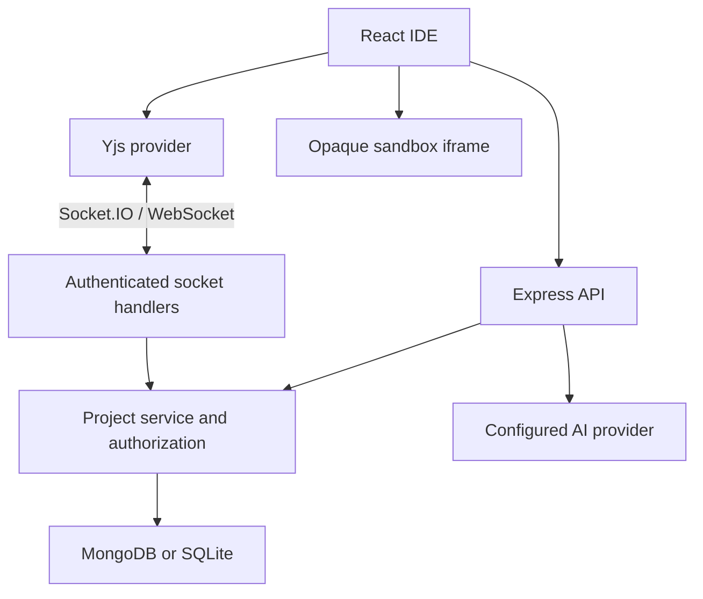

> **SyncStudio 3:** This document describes the retained collaborative subsystem. See [RUNTIME.md](RUNTIME.md) for the new code-server runner, terminal, language environments, gateway, and guarded imports.

# SyncStudio architecture

## Runtime boundaries



React Router owns navigation. TanStack Query owns authenticated identity and structural project metadata. The collaboration provider owns Y.Doc objects, IndexedDB persistence, pending updates, connection status and awareness. Monaco binds to Y.Text and does not own a second copy of source text. LocalStorage contains only UI preferences and tab IDs; source recovery uses IndexedDB.

## Server layers

- `app.ts`: HTTP wiring, validation, security middleware and thin route handlers.
- `auth.ts`: cookie/session creation, lookup, hashing and revocation.
- `service.ts`: permissions, filesystem invariants, mutation serialization, versions and activities.
- `sockets.ts`: authenticated event transport, durable update acknowledgements, validated presence.
- `store.ts`: storage contract with SQLite and Mongo implementations.
- `templates.ts`: real working starter files and authoritative initial CRDT state.
- `ai.ts`: bounded context construction and an OpenAI-compatible provider adapter.

Server-only credentials never enter the frontend bundle. No arbitrary project code runs on the server.

## Data model

| Record | Fields / responsibility | Indexes or bounds |
|---|---|---|
| Account | UUID, username, normalized email, password hash | Unique email, case-insensitive username key, UUID |
| Session | Hashed random token, account ID, absolute expiry | Unique token hash; Mongo TTL expiry, SQLite expiry index |
| Project aggregate | Name, description, template, owner, member-role map, epoch, revision, timestamps | UUID; Mongo member-ID index |
| Embedded file | UUID, canonical path, file/folder type, text and encoded CRDT state | Unique path validated under project lock |
| Embedded version | UUID, message, author, timestamp, complete file snapshot, changed-file count | Maximum 30; included in aggregate byte limit |
| Embedded activity | UUID, actor, action, target, timestamp | Most recent 300 |
| Embedded comment | File UUID, line range, author, body, replies, resolved state | 200 threads, 100 replies per thread |
| Presence | Server-derived user/color, Yjs client ID, file ID, relative cursor positions | Ephemeral per socket; never in the database |

Embedding the project filesystem and snapshots is intentional: restore and its recovery snapshot fit in one atomic database record write, even with standalone Mongo. The aggregate is limited to 10 MB, safely below Mongo's BSON document ceiling, and 150 filesystem nodes. File text is limited to 200,000 characters and each persisted CRDT state to 1 MB. This design targets small-team workspaces, not huge repositories. Content duplicates the CRDT's text for snapshots, read APIs and exports; Yjs state is authoritative for edit merging.

## Collaborative editing

```mermaid
sequenceDiagram
  participant A as Editor A
  participant S as Server
  participant D as Database
  participant B as Editor B
  A->>S: Authenticate and join project
  S->>S: Verify session and membership
  A->>S: document:sync with state vector
  S-->>A: Missing update and server vector
  A->>S: Local missing Yjs update
  S->>S: Serialize mutation; check role and epoch
  S->>D: Persist merged project record
  D-->>S: Durable write complete
  S-->>A: Acknowledge saved
  S-->>B: Broadcast incremental update
```

A file starts with a single server-generated Y.Doc. Clients never independently insert the starter text, which avoids duplicated initial content. On connect, clients load their epoch-specific IndexedDB state, request missing server updates and send missing local updates. Local edits are merged and sent after a 180 ms debounce. Server acknowledgements follow successful storage; receiving a peer update alone does not mean an unacknowledged local edit is durable.

State vectors avoid whole-text replacement. CRDT update idempotence makes replay after lost acknowledgements safe. A per-project promise queue serializes mutations within the single server process. REST changes and socket changes use the same queue, so rename, delete, role updates and restore cannot race inside that process.

Presence sends relative Yjs selections for y-monaco. The server validates the shape and replaces all user/color identity with authenticated values. Socket disconnection removes presence. Session expiration has a disconnect timer; logout disconnects that session's active sockets. Membership changes evict the affected member from the room.

## Restore

1. Authorize OWNER inside the project queue.
2. Find the requested version only inside that project.
3. Create a recovery snapshot of the currently persisted files.
4. Recreate the snapshot filesystem with fresh file IDs and CRDT state.
5. Increment the project epoch, clear file-specific comments, append an activity.
6. Persist the complete record atomically.
7. Tell connected clients to reload the generation.

Old-epoch updates are rejected; disconnected clients cannot resurrect deleted/restored work. Old IndexedDB databases remain on that device as a recovery source, but there is no automatic merge across restore epochs. Comments use creation-time line numbers and are cleared on restore, as the confirmation states.

## Preview

The browser parses the selected entry HTML, resolves linked CSS and scripts, transpiles TS/JSX with a locally served Babel build, and runs a CommonJS module registry inside an iframe. A bundled, fixed React/ReactDOM runtime supports React projects without a package install service. Relative local JS/TS imports and CSS imports are supported; arbitrary npm packages, server processes, terminals and external network requests are not.

The iframe has only `sandbox="allow-scripts"`, never `allow-same-origin`. Its CSP denies network connections, form submission and embedding external resources. Console messages are accepted only from the exact iframe window with the matching channel and a bounded message shape. React escapes all console text in the IDE. This isolates DOM/cookie access, not CPU consumption: an infinite loop can still freeze a tab. Production deployments serving hostile code should move previews onto a separate origin and add execution quotas.

## AI

Context includes a path tree (5,000 characters), current file (20,000), selection (12,000) and up to three related-file excerpts. The provider receives explicit instructions to treat files as untrusted data. Requests have a timeout and rate limit. JSON output is schema-checked and rendered as text. Changes are offered as a full-file Monaco diff, with explicit Apply. Apply verifies the file still equals the proposal's base content, then edits Y.Text in a transaction. Large files cannot receive partial-context replacement proposals. No real model response is fabricated when configuration is missing.
