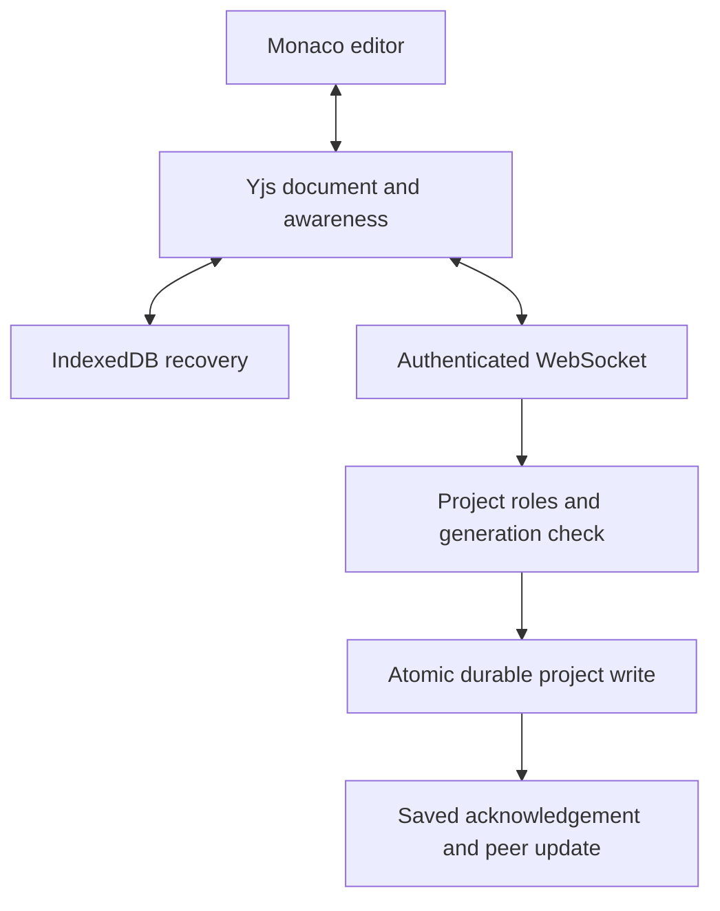

# Collaborative editor reference (v2 mode)

This reference describes the retained collaborative editor. The v3 full IDE and current verification status are documented in the root README and RUNTIME.md. Historical delivery statements below refer to v2.

# SyncStudio

A browser-based collaborative IDE built with React, TypeScript, Monaco, Yjs and an authenticated Node.js backend.

SyncStudio combines concurrent editing, a nested project filesystem, isolated live previews, source snapshots, comments, project roles and a review-first AI assistant. This repository is a substantial rebuild of the supplied original SyncStudio source; see [the legacy audit](docs/LEGACY_AUDIT.md).

> Delivery status: the application is implemented and the local lint, strict typecheck, 30 automated tests and production build pass. Live browser checks cover editing, two-tab synchronization/presence, preview/console, nested files and snapshot diffs. Live AI needs your API key. Docker, the Mongo-specific gate and the independent-context Playwright suite still need execution in your environment. See [verification](docs/VERIFICATION.md) for exact evidence and limitations.


## Run locally

Prerequisite: Node.js **24 or newer** and npm. The default uses a persistent SQLite database and needs no separate database service.

```bash
npm ci
cp .env.example .env
npm run dev
```

On Windows PowerShell, replace the copy command with:

```powershell
Copy-Item .env.example .env
```

Open **http://localhost:5173**, create an account, and create a project. Passwords must have at least 10 characters. To collaborate, register a second account in an incognito window, then add that account's email from the project's Members panel.

`npm run dev` starts the API on 3001 and Vite on 5173. Vite proxies `/api` and `/socket.io` to the API so cookies and sockets stay same-origin. Source is persisted under `.data/syncstudio.db`, not browser session storage. IndexedDB holds offline CRDT recovery updates; localStorage holds editor preferences and open tab IDs.

## Features

- Registration, login, session restoration and logout with HttpOnly cookies and server revocation.
- Project dashboard with search, recent/owned/shared filters, templates and duplication.
- OWNER, EDITOR and VIEWER permissions enforced on REST and socket operations.
- Nested folders and files; create, rename/move, duplicate, recursive delete and collision checks.
- Monaco tabs, retained editor view state, formatting, language support, autocomplete, minimap, word wrap, font size and themes.
- Yjs collaborative documents, y-monaco cursor/selection rendering, authenticated presence and reconnect synchronization.
- Debounced autosave with durable server acknowledgements and offline recovery in IndexedDB.
- Project-wide filename/content search, file/line navigation and a keyboard-accessible command palette.
- HTML/CSS/JS, React, JavaScript and TypeScript starter projects with working preview entrypoints.
- Sandboxed previews with local dependency resolution, TS/JSX compilation, responsive viewports, auto-refresh controls and runtime console.
- Source snapshots, Monaco diff inspection, automatic recovery snapshots and generation-safe restores.
- Line-range comments, replies, resolution and a bounded activity feed.
- AI explanations and proposed code changes through a configurable server-side provider; explicit diff review and Apply with stale-base checks.
- Individual file download and complete project JSON export from the command palette.
- Optional real demo workspaces and a seed script for multi-account demonstration.
- Docker/Compose, CI, automated security/convergence tests, architecture and interview documentation.

## Shortcuts

| Shortcut | Action |
|---|---|
| Ctrl/Cmd + S | Flush all pending changes |
| Ctrl/Cmd + P | Quick open |
| Ctrl/Cmd + Shift + P | Command palette |
| Ctrl/Cmd + B | Toggle sidebar |
| Ctrl/Cmd + Tab / Shift + Tab | Cycle open tabs |

The command palette also provides formatting, preview/theme toggles, close others/all, project export, snapshots, members and AI navigation.

## Stack and structure

```text
syncstudio/
  apps/
    api/src/         # Auth, routes, project service, stores, sockets, AI
    web/src/
      components/   # Dashboard, editor, explorer, preview, history, panels
      lib/          # API, CRDT provider, preview compiler, optional WebMCP
  packages/shared/src/  # Contracts, roles, schemas and event names
  tests/
    integration.test.ts # Real HTTP/WebSocket security and collaboration
    core.test.ts        # Paths, context limits, SQLite durability
    ai.test.ts          # HTTP provider contract and failure handling
    mongo.integration.ts
    e2e/workspace.spec.ts
  scripts/            # Development runner, preview build, seed
  docs/               # Audit, architecture, APIs, system design, verification
  .github/workflows/ci.yml
  Dockerfile
  compose.yaml
```

Frontend: React, TypeScript, Vite, React Router, TanStack Query, Monaco, Lucide, Yjs, y-monaco, y-indexeddb, locally served Babel. Styling uses a small CSS token system rather than adding a utility framework dependency.

Backend: Node 24, TypeScript, Express 5, Socket.IO, Zod, bcrypt, Helmet, rate limiting and Pino. Storage adapters: Mongoose/MongoDB or Node's built-in SQLite.

## How real-time collaboration works

Monaco edits a Y.Text through y-monaco. The browser provider batches binary Yjs updates, sends them over an authenticated Socket.IO WebSocket, and retains local changes in IndexedDB. The server verifies session, room membership, role, file and project generation, merges the update, persists it, then broadcasts and acknowledges. “Saved” means the write was acknowledged by the server.

On reconnect, state vectors identify missing updates in each direction. Yjs merges concurrent inserts/deletes, so receiving a peer update does not replace the whole file. Presence and relative selections travel separately from durable file state. A restore increments the project generation; stale offline updates cannot overwrite the restored workspace.



See [architecture](docs/ARCHITECTURE.md) and [system design](docs/SYSTEM_DESIGN.md) for the full reasoning, failure cases and scaling tradeoffs.

## Authentication and permissions

Sessions use 256-bit random tokens in HttpOnly, SameSite=Strict cookies, with Secure cookies in production. Only token hashes are stored on the server. Logout revokes the record and disconnects the session's sockets; expiry also disconnects sockets. No long-lived authentication token is stored in localStorage.

| Operation | Owner | Editor | Viewer |
|---|---|---|---|
| Read files, preview, history, activity, AI explanation | Yes | Yes | Yes |
| Edit code, manage files, comment, snapshot | Yes | Yes | No |
| Project settings/delete, members, restore | Yes | No | No |

All project routes check membership. Socket events independently check permissions. User IDs or usernames sent in event payloads cannot replace the authenticated identity. Mutating HTTP requests require an exact configured Origin. Project code never executes in the main application DOM or backend process.

## Environment variables

| Variable | Default / use |
|---|---|
| `NODE_ENV` | `development`; set `production` for HTTPS deployments |
| `PORT` | `3001` |
| `CLIENT_URL` | `http://localhost:5173`; exact browser origin, including port |
| `DATA_DRIVER` | `sqlite` or `mongo` |
| `SQLITE_PATH` | `.data/syncstudio.db` |
| `MONGO_URI` | `mongodb://localhost:27017/syncstudio` |
| `AI_BASE_URL` | `https://api.openai.com/v1`; OpenAI-compatible endpoint base |
| `AI_API_KEY` | Blank disables the provider; server-only |
| `AI_MODEL` | Example default `gpt-4.1-mini`; set a model supported by your provider |
| `ENABLE_DEMO` | `false`; enable only when you want real disposable demo accounts |
| `SEED_PASSWORD` | Required only for the development seed script |
| `MONGO_TEST_URI` | Optional isolated Mongo database for the dedicated Mongo gate |

Copy `.env.example`, never commit `.env`. Startup validates configuration and requires HTTPS `CLIENT_URL` in production. Choosing another AI provider is a server-side configuration change. No paid API call can be verified until you provide your own credential.

## MongoDB and Docker

With Docker available:

```bash
docker compose up --build
```

Open **http://localhost:3001**. Compose starts the built app and a private MongoDB service with a persistent named volume. The local Compose profile deliberately uses development cookie settings because localhost is HTTP. The production image defaults to production mode; deploy it with an HTTPS origin and appropriate database credentials.

```bash
docker compose down          # Keeps the database volume
```

Do not add `--volumes` unless you intend to delete the database.

For an independently running Mongo instance, set `DATA_DRIVER=mongo` and `MONGO_URI` in `.env`, then run `npm run dev`. The current project aggregate design uses one atomic Mongo document per project and does not require a replica set for restores.

## Seed a demonstration

Bash:

```bash
SEED_PASSWORD='ChooseYourOwnDemoPassword' npm run seed
```

PowerShell:

```powershell
$env:SEED_PASSWORD='ChooseYourOwnDemoPassword'
npm run seed
```

Creates `alex@example.test` (owner), `sam@example.test` (editor), and `taylor@example.test` (viewer), plus vanilla and React projects. The script refuses production mode and does not reset existing passwords. Use only development databases.

Alternatively enable `ENABLE_DEMO=true` and use **Try a demo workspace**. That button creates real backend records and a normal session; it is not a mock frontend. Disable it on a public deployment unless you add a cleanup policy and abuse quotas. Demo accounts have no recoverable password and are intended for that browser session.

## Tests and CI

```bash
npm run lint
npm run typecheck
npm test
npm run build
# All four above:
npm run check

# Separate environment gates:
npm run test:mongo
npx playwright install chromium
npm run test:e2e
```

Tests cover invalid sessions, origin checks, forbidden project access, role enforcement, file-tree invariants, snapshots/recovery, comments, identity spoofing, unauthorized sockets, presence, revocation, concurrent convergence, offline replay, persistence restart and AI failure handling. The Playwright suite uses separate account/browser contexts. CI runs the local checks, Mongo tests against a Mongo service, and Playwright tests; failures fail the job.

See [the verification record](docs/VERIFICATION.md) before describing tests as passed in a resume or demonstration.

## Production start and deployment

```bash
npm ci
npm run build
npm start
```

For a local production-bundle check on HTTP, keep `NODE_ENV=development` and set `CLIENT_URL=http://localhost:3001`. For deployment, use `NODE_ENV=production` and `CLIENT_URL=https://your-domain`.

Deploy **one Node instance** behind an HTTPS reverse proxy with WebSocket upgrade support. Serve the frontend and API under the same origin. Use a persistent database, backups and log retention. A static-only host cannot run this full application. Do not enable multiple API replicas until shared document ownership and persistence concurrency are implemented. See [system design](docs/SYSTEM_DESIGN.md) for the scaling path.

## Known limitations and next improvements

- Single API process; no Redis adapter, distributed room ownership or multi-region consistency yet.
- Bounded small-team workspaces: 150 nodes, 200,000 characters/file, 1 MB CRDT/file, 10 MB/project and 30 snapshots.
- Preview supports local browser modules and bundled React, not arbitrary npm dependencies, Node/Python execution, a terminal, external APIs or a package manager.
- Sandbox isolation does not prevent infinite loops from consuming the browser tab's CPU. Separate preview origins and resource-limited execution are the next hardening step.
- Comments use fixed creation-time line ranges; they do not re-anchor through edits. Restore clears comments, with explicit confirmation.
- Offline edits survive ordinary reconnect, but old restore generations require manual recovery; there is no cross-generation merge UI.
- The aggregate store rewrites a bounded project record on each debounced update. Large-scale operation needs append-only document updates, compaction, object snapshots and room ownership.
- No GitHub OAuth, git import/push, outbound email delivery, password-reset email flow or deployment-from-editor feature. Members must have registered accounts.
- No automated migration of legacy credentials or fragile parent-reference snapshots. Back up and import source deliberately.
- The AI provider and deployment-specific Mongo/Docker/E2E gates must be verified in your target environment.

## Project explanation and engineering notes

[System design](docs/SYSTEM_DESIGN.md) includes a natural interview explanation, the difference between CRDT convergence and semantic correctness, security boundaries, failure handling, a scaling proposal and the major engineering challenges solved. [API contracts](docs/API.md) document REST permissions and the WebSocket event flow.
