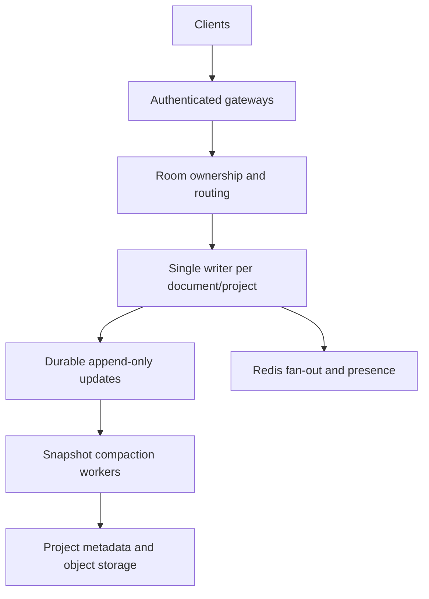

> **SyncStudio 3:** This document describes the retained collaborative subsystem. See [RUNTIME.md](RUNTIME.md) for the new code-server runner, terminal, language environments, gateway, and guarded imports.

# System design and interview guide

## Requirements and implemented operating envelope

The application supports authenticated small-team coding, simultaneous text edits, durable state, previews, source snapshots, code discussions and a provider-backed assistant. Editors must not overwrite one another simply because their network messages arrive in a different order. Project permissions must be enforced on reads and writes, including sockets.

The implemented topology is **one Node process** plus SQLite or MongoDB. It is not horizontally safe to start multiple independent API processes against the same database: each has its own mutation queue and room registry. Redis is deliberately absent until a room-ownership design is implemented. A Socket.IO Redis adapter alone would distribute messages but would not make read-modify-write project persistence safe.

## Why Yjs instead of last-write-wins?

A last-write-wins system broadcasts whole text and replaces the receiver's current file. Two people typing from the same starting text can erase each other's work. Yjs assigns identities to inserted items and encodes operations so independently produced changes can merge. Applying the same update twice is harmless. State vectors describe what a peer already has so reconnect can exchange missing information.

Convergence is not the same as semantic correctness. Two users can produce convergent but syntactically broken code. A CRDT does not enforce project membership, preserve an intended program meaning, or replace persistence. Those are separate responsibilities.

## Consistency choices

| Area | Choice | Tradeoff |
|---|---|---|
| Text edits | Yjs convergence + durable acknowledgement | More metadata than plain strings |
| File tree / roles / versions | Serialized project mutations | A busy project is a contention boundary |
| Persistence | Atomic aggregate replacement | Easy restore; large projects are intentionally limited |
| Offline editing | IndexedDB and state-vector replay | Device-local source remains after logout; no cross-epoch automatic merge |
| Presence | Ephemeral validated socket state | Reconstructed after reconnect; not historical audit data |
| Snapshot | Point-in-time persisted files | Does not include peers' unsent offline edits |
| AI changes | Human review + base-content check | User must request a fresh suggestion after intervening edits |

## Failure handling

- Disconnect: keep editable Y.Doc state and IndexedDB updates; show offline status; reconnect with backoff.
- Lost acknowledgement: retry via missing-update synchronization; CRDT update idempotence prevents duplicate text.
- Database failure: return an error; retain pending client updates; do not broadcast an unpersisted change as saved.
- Invalid/corrupted update: reject it; project mutation never commits the temporary document.
- Delete/restore: reject stale file IDs or epochs. Keep old local recovery state rather than replaying it into new files.
- Role removal: evict the socket and reject further events, even if the client still shows an edit control.
- Session expiry: disconnect sockets; REST and socket events also independently validate sessions.
- Provider timeout or malformed output: display a safe error and leave code unchanged.

## Scaling to thousands of active rooms: next architecture

Use deterministic room placement or a lease-backed actor model. Route all writes for a document to its owner, with fencing tokens on ownership changes. Separate file metadata from document updates; append binary updates durably, batch acknowledgements, and compact them into snapshots asynchronously. Store large immutable source snapshots in object storage rather than inside the project record. Use Redis for inter-gateway fan-out, presence TTLs, distributed rate limits and coordination, not as the only durable store.

Add persistence-level optimistic concurrency or database transactions to guard non-document metadata. Restores require a project epoch barrier that fences old writers. Use project/document revisions to deduplicate activity events and broadcasts. Measure active room count, update size, queue delay, persistence latency, reconnect duration, rejected events and heap usage. Load tests must distinguish one hot document from many idle rooms; total WebSocket count alone is not a useful capacity claim.

## Security discussion

Authentication answers who a caller is; project authorization answers what that caller may do. The original code confused those two by accepting a valid JWT as sufficient for arbitrary project IDs. In this implementation all sensitive socket operations are authorized again, not merely at initial room join. Sessions use cryptographically random tokens; only token hashes are persisted. Long-lived bearer credentials are absent from browser storage.

SameSite cookies and explicit Origin checks protect mutations. Socket handshakes require an allowed origin (or a demonstrably same-origin polling request); the browser provider uses WebSocket transport. Paths are values, never shell commands or regex programs. The server never invokes a user's source file. Bounded inputs protect CPU, memory, persistence and AI cost, though production abuse protection needs distributed quotas and stronger tenant limits.

## Interview explanation

“SyncStudio is a browser-based collaborative IDE I rebuilt around three separate concerns: text convergence, authorization and durability. Monaco is bound to a Yjs document, so concurrent changes merge instead of replacing an entire file. Authenticated WebSockets carry incremental updates, and the server checks project membership and role for every sensitive event. A change is marked saved only after persistence succeeds. Restore creates a recovery snapshot and increments a document generation so stale offline edits cannot bring deleted code back. Preview code runs inside an opaque sandbox, while the AI assistant proposes a reviewed diff and never gets to silently change the project.”

Engineering challenges to discuss: authoritative initial CRDT seeding, idempotent reconnect replay, read-only enforcement on sockets, role revocation, restore epochs, preserving local updates across lost acknowledgements, bounded provider context, stale AI proposals and browser preview isolation.

Do not claim multi-region operation, thousands of tested rooms, server-side container execution, Git hosting integration or production security certification. Those are not implemented or measured in this delivery.
